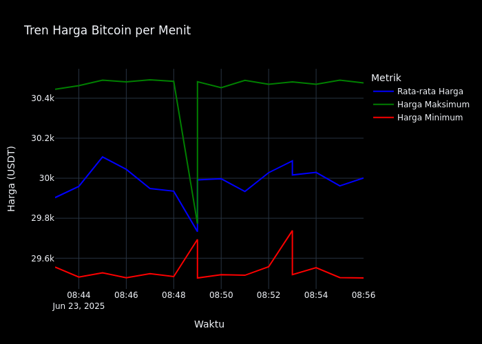

# Dinamika Pasar Bitcoin: Analisis Data Real-Time dengan Pipeline Big Data

## Pendahuluan

Bitcoin, sebagai cryptocurrency terbesar di dunia, telah menjadi aset digital yang menarik perhatian investor, trader, dan analis pasar. Artikel ini menyajikan analisis komprehensif tentang dinamika pasar Bitcoin berdasarkan data yang dikumpulkan melalui pipeline data engineering yang kami kembangkan menggunakan teknologi big data modern.

### Arsitektur Pipeline Data

Proyek ini mengimplementasikan pipeline data end-to-end yang terdiri dari:

1. **Data Collection**: Menggunakan Kafka Producer untuk mengumpulkan data pasar Bitcoin secara real-time dari API Binance
2. **Data Ingestion**: Kafka Consumer menyimpan data mentah ke MongoDB untuk persistensi
3. **Data Processing**: Apache Spark melakukan agregasi dan analisis data streaming
4. **Workflow Orchestration**: Apache Airflow mengatur jadwal dan dependensi tugas
5. **Visualization**: Dashboard interaktif dengan Streamlit menampilkan insight dari data

Pipeline ini memungkinkan analisis real-time terhadap pergerakan pasar Bitcoin, memberikan insight yang berharga bagi trader dan investor.

## Analisis Tren Harga Bitcoin



Grafik di atas menunjukkan pergerakan harga rata-rata Bitcoin dalam interval satu menit, dengan area bayangan yang menunjukkan rentang antara harga minimum dan maksimum. Data ini diproses menggunakan Spark Structured Streaming yang mengagregasi data per menit dari stream Kafka.

**Insight Teknis:**
- Volatilitas intra-menit dapat diukur dari lebar area bayangan
- Pola tren dapat diidentifikasi dari kemiringan kurva harga rata-rata
- Titik-titik ekstrem (harga tertinggi dan terendah) memberikan indikasi level support dan resistance jangka pendek

**Implementasi:**
```python
# Contoh kode Spark untuk agregasi harga
windowedCounts = df \
    .withWatermark("timestamp", "1 minute") \
    .groupBy(window("timestamp", "1 minute")) \
    .agg(
        avg("last_price").alias("avg_price"),
        min("last_price").alias("min_price"),
        max("last_price").alias("max_price")
    )
```

## Analisis Volume Perdagangan


Grafik batang ini menunjukkan volume perdagangan rata-rata Bitcoin dalam interval satu menit. Warna gradien membantu mengidentifikasi periode dengan volume perdagangan tinggi (warna lebih terang) dan rendah (warna lebih gelap).

**Insight Teknis:**
- Volume adalah indikator konfirmasi untuk pergerakan harga
- Lonjakan volume sering mendahului pergerakan harga signifikan
- Periode volume rendah biasanya menandakan konsolidasi sebelum pergerakan besar

**Implementasi Data Processing:**
```python
# Contoh kode Spark untuk agregasi volume
volumeAnalysis = df \
    .withWatermark("timestamp", "1 minute") \
    .groupBy(window("timestamp", "1 minute")) \
    .agg(
        avg("volume_24h").alias("avg_volume"),
        sum("volume").alias("total_volume")
    )
```

## Korelasi Harga dan Volume


Grafik ini menunjukkan hubungan antara harga rata-rata (garis biru) dan volume perdagangan (batang oranye) Bitcoin. Anotasi menunjukkan titik-titik penting: harga tertinggi, harga terendah, dan volume tertinggi.

**Insight Teknis:**
- Divergensi harga-volume: Ketika harga naik tetapi volume menurun, ini sering menandakan tren yang melemah
- Konfirmasi tren: Volume tinggi yang mengikuti pergerakan harga mengkonfirmasi kekuatan tren
- Titik balik: Volume ekstrem sering terjadi pada titik balik pasar

**Implementasi Visualisasi:**
```python
# Contoh kode Plotly untuk visualisasi harga-volume
fig = make_subplots(specs=[[{"secondary_y": True}]])
fig.add_trace(
    go.Scatter(x=df['window_start'], y=df['avg_price'], name='Rata-rata Harga'),
    secondary_y=False
)
fig.add_trace(
    go.Bar(x=df['window_start'], y=df['avg_volume'], name='Rata-rata Volume'),
    secondary_y=True
)
```

## Analisis Market Impact


Market impact mengukur seberapa besar pengaruh transaksi terhadap pergerakan harga pasar. Nilai ini dihitung menggunakan algoritma yang mempertimbangkan volume transaksi dan perubahan harga yang dihasilkan.

**Insight Teknis:**
- Market impact tinggi menunjukkan pasar yang kurang likuid
- Trader institusional menggunakan metrik ini untuk meminimalkan slippage
- Perubahan mendadak dalam market impact dapat mengindikasikan perubahan struktur pasar

**Implementasi Algoritma:**
```python
# Pseudocode untuk perhitungan market impact
def calculate_market_impact(price_change, volume):
    return abs(price_change) / (volume + epsilon)

# Implementasi di Spark
marketImpactDF = df \
    .withColumn("market_impact", abs(col("price_change")) / (col("volume") + lit(0.0001))) \
    .groupBy(window("timestamp", "1 minute")) \
    .agg(avg("market_impact").alias("avg_market_impact"))
```

## Integrasi dengan Sistem Monitoring

Dashboard ini terintegrasi dengan sistem monitoring yang memungkinkan pengguna untuk:

1. Melihat data real-time yang diperbarui setiap 5 menit
2. Mengakses visualisasi interaktif dengan fitur zoom, pan, dan hover
3. Memahami insight pasar melalui analisis yang disediakan

Sistem ini menggunakan MongoDB sebagai data store dan Streamlit sebagai frontend, dengan Airflow menjadwalkan pembaruan visualisasi secara berkala.

## Kesimpulan dan Implikasi

Analisis komprehensif pasar Bitcoin ini mengungkapkan beberapa insight penting:

1. **Volatilitas Sebagai Karakteristik Utama**: Volatilitas tinggi Bitcoin bukan hanya risiko, tetapi juga sumber peluang bagi trader yang memahami dinamika pasar.

2. **Pentingnya Volume dan Likuiditas**: Volume perdagangan dan likuiditas adalah indikator penting yang melengkapi analisis harga.

3. **Pola dan Tren yang Dapat Diidentifikasi**: Meskipun pasar cryptocurrency sering dianggap tidak dapat diprediksi, pipeline data engineering kami menunjukkan bahwa pola dan tren dapat diidentifikasi melalui analisis data yang tepat.

4. **Manajemen Risiko yang Efektif**: Memahami volatilitas dan distribusi perubahan harga memungkinkan pengembangan strategi manajemen risiko yang lebih efektif.

### Pengembangan Masa Depan

Untuk pengembangan selanjutnya, pipeline data ini dapat diperluas dengan:

1. Implementasi algoritma machine learning untuk prediksi harga
2. Integrasi data sentimen dari media sosial dan berita
3. Analisis on-chain untuk memahami pergerakan Bitcoin di blockchain
4. Sistem alert otomatis untuk pergerakan harga signifikan

Dengan terus memantau dan menganalisis data pasar Bitcoin melalui pipeline data engineering yang canggih, investor dan trader dapat membuat keputusan yang lebih terinformasi dan potensial meningkatkan hasil investasi mereka dalam aset digital yang menarik namun menantang ini.