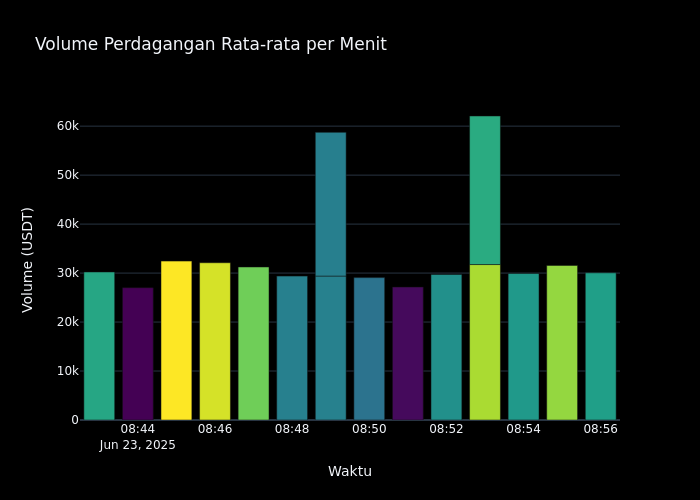
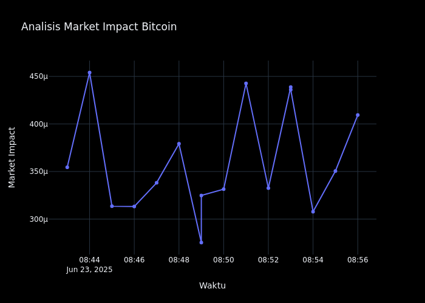

# Dinamika Pasar Bitcoin: Analisis Data dan Visualisasi

## Pendahuluan

Bitcoin, sebagai cryptocurrency terbesar di dunia, telah menjadi aset digital yang menarik perhatian investor, trader, dan analis pasar. Artikel ini menyajikan analisis komprehensif tentang dinamika pasar Bitcoin berdasarkan data yang dikumpulkan melalui pipeline data engineering yang menggabungkan Apache Kafka, Apache Spark, dan Apache Airflow.

Grafik ini menunjukkan pergerakan harga rata-rata Bitcoin dalam interval satu menit, dengan area bayangan yang menunjukkan rentang antara harga minimum dan maksimum. Visualisasi ini memungkinkan kita mengidentifikasi volatilitas jangka pendek dan tren pergerakan harga secara real-time. Area bayangan yang lebih lebar menunjukkan volatilitas yang lebih tinggi pada interval waktu tersebut, sementara area yang lebih sempit menunjukkan stabilitas harga yang relatif.

Grafik batang ini menunjukkan volume perdagangan rata-rata Bitcoin dalam interval satu menit. Warna gradien membantu mengidentifikasi periode dengan volume perdagangan tinggi (warna lebih terang) dan rendah (warna lebih gelap). Volume perdagangan adalah indikator penting yang menunjukkan likuiditas dan minat pasar. Periode dengan volume tinggi sering kali bertepatan dengan pergerakan harga yang signifikan, sementara volume rendah dapat mengindikasikan kurangnya minat atau konsolidasi pasar.

Grafik ini menunjukkan hubungan antara harga rata-rata (garis biru) dan volume perdagangan (batang oranye) Bitcoin dalam interval satu menit. Anotasi menunjukkan titik-titik penting: harga tertinggi, harga terendah, dan volume tertinggi. Hubungan antara harga dan volume memberikan wawasan tentang kekuatan tren pasar. Volume tinggi yang mengikuti pergerakan harga mengkonfirmasi kekuatan tren tersebut, sementara divergensi antara harga dan volume dapat mengindikasikan potensi pembalikan arah. Analisis ini membantu trader mengidentifikasi momentum pasar dan membuat keputusan trading yang lebih terinformasi.

Grafik ini menunjukkan market impact Bitcoin dalam interval satu menit. Market impact mengukur seberapa besar pengaruh transaksi terhadap pergerakan harga pasar. Nilai yang lebih tinggi menunjukkan bahwa transaksi memiliki pengaruh yang lebih besar terhadap harga, sementara nilai yang lebih rendah menunjukkan pasar yang lebih likuid dan efisien. Analisis ini penting untuk trader institusional dan algoritma yang perlu memahami bagaimana order besar dapat mempengaruhi pasar dan meminimalkan slippage.

## Kesimpulan

Analisis komprehensif pasar Bitcoin ini mengungkapkan beberapa insight penting:

1. **Volatilitas Sebagai Karakteristik Utama**: Volatilitas tinggi Bitcoin bukan hanya risiko, tetapi juga sumber peluang bagi trader yang memahami dinamika pasar.

2. **Pentingnya Volume dan Likuiditas**: Volume perdagangan dan likuiditas adalah indikator penting yang melengkapi analisis harga.

3. **Pola dan Tren yang Dapat Diidentifikasi**: Meskipun pasar cryptocurrency sering dianggap tidak dapat diprediksi, analisis data menunjukkan pola dan tren yang dapat diidentifikasi.

4. **Manajemen Risiko yang Efektif**: Memahami volatilitas dan distribusi perubahan harga memungkinkan pengembangan strategi manajemen risiko yang lebih efektif.

Dengan terus memantau dan menganalisis data pasar Bitcoin, investor dan trader dapat membuat keputusan yang lebih terinformasi dan potensial meningkatkan hasil investasi mereka dalam aset digital yang menarik namun menantang ini.